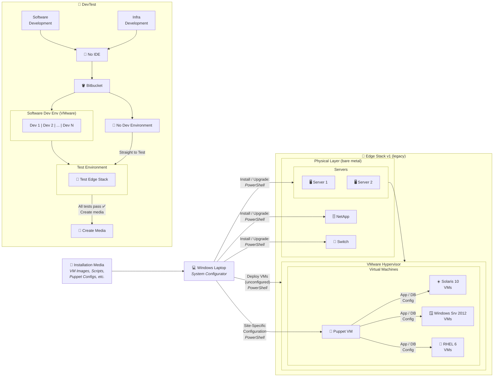

```mermaid
graph LR
    %% Dev/Test Workflow
    subgraph DevTest["🧪 DevTest"]
        direction TB

        SwDev["Software<br/>Development"]
        InfraDev["Infra<br/>Development"]

        NoIDE["🚫 No IDE"]

        %% In v2, SwDev gets an IDE but infra doesn't leverage it yet, so we'll split here to add SwDev -> DevSpaces -> Bitbucket
        SwDev --> NoIDE
        InfraDev --> NoIDE

        Bitbucket["🪣 Bitbucket"]

        NoIDE --> Bitbucket

        subgraph SwDevEnv["Software Dev Env (VMware)"]
            direction LR
            Dev1["Dev 1 | Dev 2 | ... | Dev N"]
        end

        %% NOTE: In a future iteration, this will become a subgraph with its own environments
        InfraDevEnv["🚫 No Dev Environment"]

        %% Dev
        Bitbucket --> SwDevEnv
        Bitbucket --> InfraDevEnv

        %% NOTE: No CI/CD in v1; this will sit here when it's introduced in v2
        %% Will be oversimplifying (on purpose) to have Dev -> CI/CD -> Test (even though Bitbucket should show up again in reality...)

        %% Test
        SwDevEnv --> TestEnv
        %% NOTE: The following line text will be removed when infra gets a dev env, in a future iteration!
        InfraDevEnv -->|"Straight to Test"| TestEnv

        subgraph TestEnv["Test Environment"]
            TestStack["🏢 Test Edge Stack"]
        end

        CreateMedia["📀 Create Media"]

        TestEnv -->|"All tests pass ✅<br/>Create media"| CreateMedia
    end

    %% If I had more time for formatting, I'd want to make the following link, but by default it makes the graph unreadable
    %%CreateMedia --> Media

    %% Deployment Workflow
    Media["📀 Installation Media<br/><i>VM Images, Scripts,<br/>Puppet Configs, etc.</i>"]
    Laptop["💻 Windows Laptop<br/><i>System Configurator</i>"]

    Media --> Laptop

    %% Target Environment
    subgraph EdgeStack["🏢 Edge Stack v1 (legacy)"]
        direction TB

        subgraph Physical["Physical Layer (bare metal)"]
            direction TB

            NetApp["🗄️ NetApp"]
            Switch["🔀 Switch"]

            subgraph Servers["Servers"]
                Blade1["🖥️ Server 1"]
                Blade2["🖥️ Server 2"]
            end
        end

        subgraph VMware["VMware Hypervisor"]
            direction LR
            subgraph VMs["Virtual Machines"]
                direction LR
                Sol["☀️ Solaris 10<br/>VMs"]
                Win["🪟 Windows Srv 2012<br/>VMs"]
                Lin["🐧 RHEL 6<br/>VMs"]
                Puppet["🔧 Puppet VM"]

                Puppet -->|"App / DB<br/>Config"| Sol
                Puppet -->|"App / DB<br/>Config"| Win
                Puppet -->|"App / DB<br/>Config"| Lin
            end
        end

        Servers --> VMware

    end

    Laptop -->|"Install / Upgrade:<br/><i>PowerShell</i>"| NetApp
    Laptop -->|"Install / Upgrade:<br/><i>PowerShell</i>"| Switch
    Laptop -->|"Install / Upgrade:<br/><i>PowerShell</i>"| Servers
    Laptop -->|"Site-Specific<br/>Configuration<br/><i>PowerShell</i>"| Puppet
    Laptop -->|"Deploy VMs<br/>(unconfigured)<br/><i>PowerShell</i>"| VMware

    %% TODO: Keeping this here as an example; style later, when the core content is done
    %% Styling
    %% style Media fill:#2374ab,stroke:#a5a8a,color:#ffffff

    %% Color Palette
    %% Blue:    fill:#2374ab,stroke:#1a5a8a,color:#ffffff
    %% Green:   fill:#2a9d4e,stroke:#1f7a3b,color:#ffffff
    %% Orange:  fill:#e87f2a,stroke:#c46a1f,color:#ffffff
    %% Red:     fill:#d94040,stroke:#b03030,color:#ffffff
    %% Purple:  fill:#7b4fb0,stroke:#5e3c8a,color:#ffffff
    %% Teal:    fill:#2a9d8f,stroke:#1f7a6e,color:#ffffff
    %% Yellow:  fill:#e6b830,stroke:#c49a20,color:#333333
    %% Gray:    fill:#6c757d,stroke:#545b62,color:#ffffff
```
