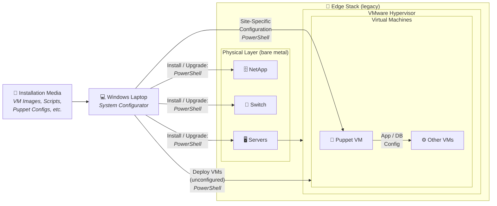

```mermaid
graph LR
    %% =====================
    %% Deployment Workflow
    %% =====================

    %% Node: Installation Media %%
    %% Physical media shipped to disconnected edge site; contains everything needed to install, deploy, and configure edge stack
    Media["📀 Installation Media<br/><i>VM Images, Scripts,<br/>Puppet Configs, etc.</i>"]

    %% Node: Windows Laptop %%
    %% On-site operator's machine; drives the entire install/upgrade process
    Laptop["💻 Windows Laptop<br/><i>System Configurator</i>"]

    %% Workflow: Operator loads media onto laptop %%

    Media --> Laptop

    %% =====================
    %% Target Environment
    %% =====================
    subgraph EdgeStack["🏢 Edge Stack (legacy)"]
        direction TB

        %% Node: Physical Layer %%
        %% Bare metal hardware at the edge site
        subgraph Physical["Physical Layer (bare metal)"]
            direction TB

            NetApp["🗄️ NetApp"]
            Switch["🔀 Switch"]
            Servers["🖥️ Servers"]
        end

        %% Node: VMware %%
        %% VMware as the hypervisor for the legacy state; to be replaced with OpenShift + OpenShift Virt
        subgraph VMware["VMware Hypervisor"]
            direction LR

            subgraph VMs["Virtual Machines"]
                direction LR

                %% Node: Virtual Machines %%
                %% All workloads run as VMs -- no containers in legacy state
                Puppet["🔧 Puppet VM"]
                OtherVMs["⚙️ Other VMs"]

                %% Workflow: Puppet applies config to apps and databases on VMs %%
                Puppet -->|"App / DB<br/>Config"| OtherVMs
            end
        end

        %% Workflow: VMware is installed on bare metal servers %%
        Servers --> VMware
    end

    %% Workflow: Laptop drives install/upgrade of edge stack %%
    %% NOTE: Everything is PowerShell in legacy state -- no Ansible anywhere. *Yet.*
    Laptop -->|"Install / Upgrade:<br/><i>PowerShell</i>"| NetApp
    Laptop -->|"Install / Upgrade:<br/><i>PowerShell</i>"| Switch
    Laptop -->|"Install / Upgrade:<br/><i>PowerShell</i>"| Servers
    Laptop -->|"Site-Specific<br/>Configuration<br/><i>PowerShell</i>"| Puppet
    Laptop -->|"Deploy VMs<br/>(unconfigured)<br/><i>PowerShell</i>"| VMs

    %% =====================
    %% Styling
    %% =====================
    %% TODO: Add styling after architecture diagrams are complete
```
