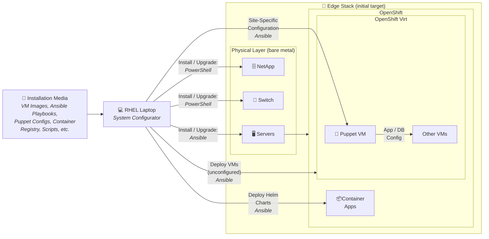

```mermaid 
graph LR
    %% =====================
    %% Deployment Workflow
    %% =====================

    %% Node: Installation Media %%
    %% Physical media shipped to disconnected edge site; contains everything needed to install, deploy, and configure edge stack
    Media["📀 Installation Media<br/><i>VM Images, Ansible Playbooks,<br/>Puppet Configs, Container<br/>Registry, Scripts, etc.</i>"]

    %% Node: RHEL Laptop %%
    %% On-site operator's machine; drives the entire install/upgrade process
    Laptop["💻 RHEL Laptop<br/><i>System Configurator</i>"]

    %% Workflow: Operator loads media onto laptop %%
    Media --> Laptop

    %% =====================
    %% Target Environment
    %% =====================
    subgraph EdgeStack["🏢 Edge Stack (initial target)"]
        direction TB

        %% Node: Physical Layer %%
        %% Bare metal hardware at the edge site
        subgraph Physical["Physical Layer (bare metal)"]
            direction LR

            NetApp["🗄️ NetApp"]
            Switch["🔀 Switch"]
            Servers["🖥️ Servers"]
        end

        %% Node: OpenShift %%
        %% Replaces VMware from legacy state; hosts both containers and VMs via OpenShift Virt
        subgraph OCP["OpenShift"]
            direction LR

            %% Node: Container Applications %%
            %% Workloads removed from VMs, deployed as containers
            Containers["📦Container<br/>Apps"]

            %% Node: Virtual Machines %%
            %% Legacy workloads still running as VMs on OpenShift Virt
            subgraph OCPVirt["OpenShift Virt"]
                direction TB
                Puppet["🔧 Puppet VM"]
                OtherVMs["Other VMs"]

                %% Workflow: Puppet applies config to apps and databases on VMs %%
                %% NOTE: Though Ansible delivers configs *to* Puppet, Puppet is still the config engine for the VMs
                Puppet -->|"App / DB<br/>Config"| OtherVMs
            end
        end

        %% Workflow: OpenShift is installed directly on bare metal servers %%
        Servers --> OCP
    end

    %% Workflow: Laptop drives install/upgrade of edge stack %%
    Laptop -->|"Install / Upgrade:<br/><i>PowerShell</i>"| NetApp
    Laptop -->|"Install / Upgrade:<br/><i>PowerShell</i>"| Switch
    Laptop -->|"Install / Upgrade:<br/><i>Ansible</i>"| Servers

    %% Workflow: Laptop pushes site-specific config data to Puppet VM (via Ansible) %%
    Laptop -->|"Site-Specific<br/>Configuration<br/><i>Ansible</i>"| Puppet

    %% Workflow: Laptop deploys workloads to OpenShift %%
    Laptop -->|"Deploy VMs<br/>(unconfigured)<br/><i>Ansible</i>"| OCPVirt
    Laptop -->|"Deploy Helm<br/>Charts<br/><i>Ansible</i>"| Containers

    %% =====================
    %% Styling
    %% =====================

    %% TODO: Add styling after architecture diagrams are complete
```
