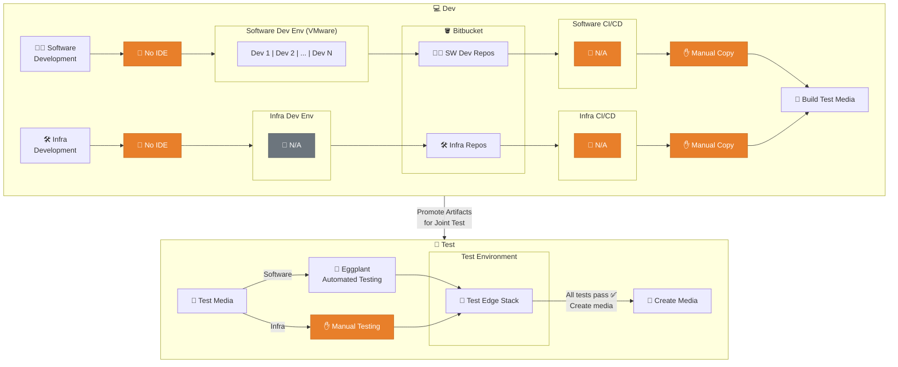

```mermaid
graph TB
    %% =====================
    %% Dev Workflow
    %% =====================
    subgraph Dev["💻 Dev"]
        direction LR

        %% Node: Teams %%
        %% These are the starting points for the workflow -- represents the teams doing the work
        SwDev["👩‍💻 Software<br/>Development"]
        InfraDev["🛠️ Infra<br/>Development"]

        %% Node: IDEs %%
        %% This is where teams are developing software/playbooks/etc.
        %% NOTE: Neither team uses an IDE; software team edits directly in Bitbucket, infra team edits in Vim
        NoIDESw["🚫 No IDE"]
        NoIDEInfra["🚫 No IDE"]

        %% Workflow: Leveraging IDEs %%
        %% NOTE: Or, NOT leveraging IDEs, in the legacy architecture...
        SwDev --> NoIDESw
        InfraDev --> NoIDEInfra

        %% Node: Dev Environments %%
        %% This is where work is validated before merging it into version control
        %% NOTE: Software has a VMware-based dev environment; infra, horrifyingly enough, has nothing
        subgraph SwDevEnv["Software Dev Env (VMware)"]
            direction LR
            Dev1["Dev 1 | Dev 2 | ... | Dev N"]
        end

        subgraph InfraDevEnv["Infra Dev Env"]
            NoInfraDev["🚫 N/A"]
        end

        %% Workflow: Running WIP in Dev Environments %%
        NoIDESw --> SwDevEnv
        NoIDEInfra --> InfraDevEnv

        %% Node: Version Control %%
        %% Both teams use Bitbucket, but are editing directly in it (no local IDE)
        subgraph Bitbucket["🪣 Bitbucket"]
            direction LR
            InfraRepos["🛠️ Infra Repos"]
            SwRepos["👩‍💻 SW Dev Repos"]
        end

        %% Workflow: Capturing developed code in version control %%
        SwDevEnv --> SwRepos
        InfraDevEnv --> InfraRepos

        %% Node: CI/CD %%
        %% No CI/CD exists for either team in legacy state
        %% NOTE: CI/CD was actively introduced in the target state -- and even then, only software adopted it
        subgraph SwCICD["Software CI/CD"]
            NoSwCICD["🚫 N/A"]
        end
 
        subgraph InfraCICD["Infra CI/CD"]
            NoInfraCICD["🚫 N/A"]
        end

        %% Workflow: Repos to CI/CD (neither has it) %%
        SwRepos --> SwCICD
        InfraRepos --> InfraCICD

        %% Node: Artifact Storage %%
        %% No proper artifact storage for either team
        SwArtifacts["✋ Manual Copy"]
        InfraArtifacts["✋ Manual Copy"]

        %% Workflow: Manual artifact handling for both teams %%
        SwCICD --> SwArtifacts
        InfraCICD --> InfraArtifacts

        %% Node: Test Media %%
        %% This is not the final delivery format; it's an ad hoc packaging to get the test env ready
        BuildTestMedia["📀 Build Test Media"]
 
        %% Workflow: Build test media manually from both teams' artifacts %%
        SwArtifacts --> BuildTestMedia
        InfraArtifacts --> BuildTestMedia
 
        %% Workflow: Promote test media to the test environment %%
        %% NOTE: Ideally would have liked this link, but it messes up the diagram
        %%BuildTestMedia --> TestEnv
    end

    %% =====================
    %% Test Workflow
    %% =====================
    subgraph Test["🧪 Test"]
        direction LR

        %% Node: Test Media %%
        %% This represents the media that was created at the end of the dev process, and delivered as disconnected media
        TestMedia["📀 Test Media"]

        %% Node: Test Approaches %%
        %% NOTE: Software has Eggplant for automated testing; infra is fully manual
        Eggplant["🍆 Eggplant<br/>Automated Testing"]
        ManualTest["✋ Manual Testing"]

        %% Workflow: Run deployment and perform automated software testing %%
        %% NOTE: This is an oversimplification that doesn't reflect that there are intermediary steps for deploying software
        TestMedia -->|"Software"| Eggplant
        TestMedia -->|"Infra"| ManualTest

        %% Node: Test Environment %%
        %% This is a shared environment -- new infra and software are deployed together
        subgraph TestEnv["Test Environment"]
            TestStack["🏢 Test Edge Stack"]
        end

        %% Workflow: Run tests against the Test Edge Stack %%
        Eggplant --> TestStack
        ManualTest --> TestStack

        %% Node: Create Media %%
        %% This is the final delivery format, to be delivered to the field
        CreateMedia["📀 Create Media"]

        %% Workflow: Capture artifacts that passed test, and create the final media delivery from them %%
        TestStack -->|"All tests pass ✅<br/>Create media"| CreateMedia
    end

    %% Workflow: Promotion from Dev to Test %%
    Dev -->|"Promote Artifacts<br/>for Joint Test"| Test

    %% =====================
    %% Styling
    %% =====================
 
    %% Both teams lack IDEs
    style NoIDESw fill:#e87f2a,stroke:#c46a1f,color:#ffffff
    style NoIDEInfra fill:#e87f2a,stroke:#c46a1f,color:#ffffff
 
    %% Infra has no dev environment (gray -- hardware limitation, not a process choice)
    style NoInfraDev fill:#6c757d,stroke:#545b62,color:#ffffff
 
    %% Neither team has CI/CD
    style NoSwCICD fill:#e87f2a,stroke:#c46a1f,color:#ffffff
    style NoInfraCICD fill:#e87f2a,stroke:#c46a1f,color:#ffffff
 
    %% Both teams rely on manual artifact handling
    style SwArtifacts fill:#e87f2a,stroke:#c46a1f,color:#ffffff
    style InfraArtifacts fill:#e87f2a,stroke:#c46a1f,color:#ffffff
 
    %% Manual testing for infra
    style ManualTest fill:#e87f2a,stroke:#c46a1f,color:#ffffff
```
