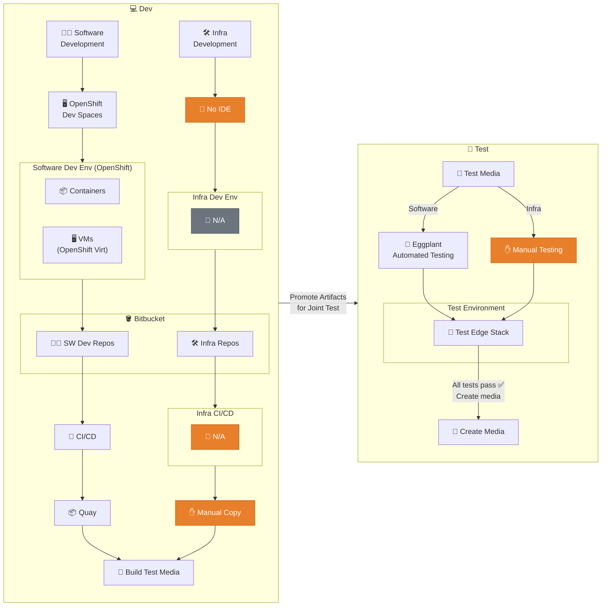

```mermaid 
graph LR
    %% =====================
    %% Dev Workflow
    %% =====================
    subgraph Dev["💻 Dev"]
        direction TB

        %% Node: Teams %%
        %% These are the starting points for the workflow -- represents the teams doing the work
        SwDev["👩‍💻 Software<br/>Development"]
        InfraDev["🛠️ Infra<br/>Development"]

        %% Node: IDEs %%
        %% This is where teams are developing software/playbooks/etc.
        %% NOTE: SwDev uses an IDE, but infra currently doesn't leverage it
        DevSpaces["🖥️ OpenShift<br/>Dev Spaces"]
        NoIDE["🚫 No IDE"]

        %% Workflow: Leveraging IDEs %%
        SwDev --> DevSpaces
        InfraDev --> NoIDE

        %% Node: Dev Environments %%
        %% This is where work is validated before merging it into version control
        subgraph SwDevEnv["Software Dev Env (OpenShift)"]
            direction LR
            DevContainers["📦 Containers"]
            DevVMs["🖥️ VMs<br/>(OpenShift Virt)"]
        end

        subgraph InfraDevEnv["Infra Dev Env"]
            NoInfraDev["🚫 N/A"]
        end

        %% Workflow: Running WIP in Dev Environments %%
        DevSpaces --> SwDevEnv
        NoIDE --> InfraDevEnv

        %% Node: Version Control %%
        %% This is where work is stored and versioned
        subgraph Bitbucket["🪣 Bitbucket"]
            direction LR
            InfraRepos["🛠️ Infra Repos"]
            SwRepos["👩‍💻 SW Dev Repos"]
        end

        %% Workflow: Capturing developed code in version control %%
        SwDevEnv --> SwRepos
        InfraDevEnv --> InfraRepos

        %% Node: CI/CD %%
        %% Automation to validate work done in dev
        CICD["🔄 CI/CD"]

        subgraph InfraCICD["Infra CI/CD"]
            NoInfraCICD["🚫 N/A"]
        end

        %% Workflow: CI/CD pulling from version-controlled repos %%
        SwRepos --> CICD
        InfraRepos --> InfraCICD

        %% Node: Artifact Storage %%
        %% This is where "ready to deliver" artifacts are stored
        Quay["📦 Quay"]
        InfraArtifacts["✋ Manual Copy"]

        %% Workflow: Capture artifacts that have been validated by CI/CD %%
        CICD --> Quay
        InfraCICD --> InfraArtifacts

        %% Node: Test Media %%
        %% This is not the final delivery format; it's an ad hoc packaging to get the test env ready
        BuildTestMedia["📀 Build Test Media"]

        %% Workflow: Build test media from containers, infra playbooks %%
        %% NOTE: Not shown: Nexus; also, "InfraArtifacts" is technically from Bitbucket, but that destroys the graph)
        Quay --> BuildTestMedia
        InfraArtifacts --> BuildTestMedia

        %% Workflow: Promote test media to the test environment %%
        %% NOTE: Ideally would have liked this link, but it messes up the diagram
        %%BuildTestMedia --> TestEnv
    end

    %% =====================
    %% Test Workflow
    %% =====================
    subgraph Test["🧪 Test"]
        direction TB

        %% Node: Test Media %%
        %% This represents the media that was created at the end of the dev process, and delivered as disconnected media
        TestMedia["📀 Test Media"]

        %% Node: Test Approaches %%
        %% NOTE: Software has automated testing, infra does not -- leading to manual failures (e.g., mistyped passwords)
        Eggplant["🍆 Eggplant<br/>Automated Testing"]
        ManualTest["✋ Manual Testing"]

        %% Workflow: Run deployment and perform automated software testing %%
        %% NOTE: This is an oversimplification that doesn't reflect that there are intermediary steps for deploying software
        TestMedia -->|"Software"| Eggplant
        TestMedia -->|"Infra"| ManualTest

        %% Node: Test Environment %%
        %% This is a shared environment, unlike dev -- new infra and software are deployed together
        subgraph TestEnv["Test Environment"]
            TestStack["🏢 Test Edge Stack"]
        end

        %% Workflow: Run tests against the Test Edge Stack %%
        Eggplant --> TestStack
        ManualTest --> TestStack

        %% Node: Create Media %%
        %% This is the final delivery format, to be delivered to the field
        CreateMedia["📀 Create Media"]

        %% Workflow: Capture artifacts that passed test, and create the final media delivery from them %%
        TestStack -->|"All tests pass ✅<br/>Create media"| CreateMedia
    end

    %% Workflow: Promotion from Dev to Test %%
    Dev -->|"Promote Artifacts<br/>for Joint Test"| Test

    %% =====================
    %% Styling
    %% =====================

    style ManualTest fill:#e87f2a,stroke:#c46a1f,color:#ffffff
    style NoIDE fill:#e87f2a,stroke:#c46a1f,color:#ffffff
    %% NOTE: Gray was chosen for the lack of infra dev env, because this is just a reality, not something we can control
    %% i.e., we sometimes need to work around real hardware limitations -- emphasis: *how* do we do that?
    style NoInfraDev fill:#6c757d,stroke:#545b62,color:#ffffff
    style NoInfraCICD fill:#e87f2a,stroke:#c46a1f,color:#ffffff
    style InfraArtifacts fill:#e87f2a,stroke:#c46a1f,color:#ffffff
```
